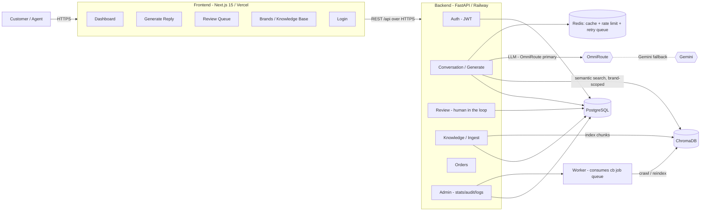
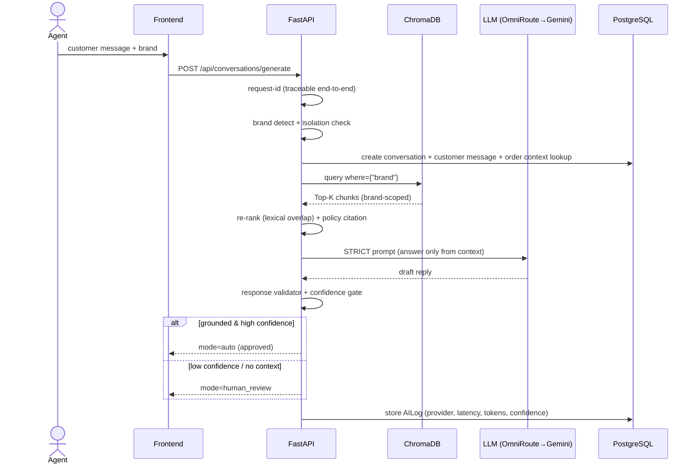

# Architecture

> A modular, deployable CX reply assistant with **strict no-hallucination guardrails**
> and **structural brand isolation** — designed with Tech-Lead-level decisions in mind.

## System diagram



## Request path (reply generation)



## Components

- **Auth** (`api/auth.py`, `core/security.py`, `api/deps.py`) — JWT (python-jose),
  bcrypt password hashing, role-based deps (`require_admin` / `require_agent`).
- **Conversation / Generate** (`api/conversations.py`) — the full pipeline: brand detect →
  isolation → semantic search → re-rank → STRICT prompt → LLM → validator → confidence →
  routing to auto or human review → AILog + audit.
- **Review** (`api/review.py`) — human-in-the-loop: approve / edit / regenerate / manual /
  send. AI **never auto-sends**; the human gate decides.
- **Knowledge / Ingest** (`api/knowledge.py`) — **manual CRUD is core**; crawling is
  optional and async. Admin reviews + edits + saves policies in-app.
- **Orders / Customers** (`api/orders.py`, models) — optional order context for the AI.
- **Admin** (`api/admin.py`) — stats dashboard, audit trail, AI logs, optional webhook.
- **Repositories / DI** (`repositories/`, `core/container.py`) — repository pattern +
  lightweight DI container for testable, explicit composition.
- **Worker** (`workers/run.py`, `workers/jobs.py`) — background job/retry consumer
  (crawl, re-index) fed by Redis.
- **Infra** (`core/redis_client.py`, `core/request_id.py`) — Redis cache, fixed-window rate
  limiting, request-id middleware, retry queue (graceful in-memory fallback).

## Data model (11 tables, Alembic-managed)

```mermaid
erDiagram
    USERS      { string id PK; string email UK; string hashed_password; string role }
    BRANDS     { string id PK; string name UK }
    BRAND_SOURCES { string id PK; string brand_id FK; string source_url; string policy_type }
    KNOWLEDGE_BASE { string id PK; string brand_id FK; string source_id FK; string policy_type; text content }
    EMBEDDINGS { string id PK; string brand_id FK; string knowledge_id FK; string vector_id }
    CUSTOMERS  { string id PK; string brand_id FK }
    ORDERS     { string id PK; string brand_id FK; string customer_id FK; string order_number }
    CONVERSATIONS { string id PK; string brand_id FK; string customer_id FK }
    MESSAGES   { string id PK; string conversation_id FK; string brand_id FK; text draft/final; float confidence; string citation }
    AI_LOGS    { string id PK; string brand_id FK; string conversation_id FK; string provider; int latency_ms }
    AUDIT_LOGS { string id PK; string actor_user_id; string action }

    BRANDS ||--o{ BRAND_SOURCES : owns
    BRANDS ||--o{ KNOWLEDGE_BASE : owns
    KNOWLEDGE_BASE ||--o{ EMBEDDINGS : "vector registry"
    BRANDS ||--o{ CUSTOMERS : serves
    CUSTOMERS ||--o{ ORDERS : places
    BRANDS ||--o{ CONVERSATIONS : has
    CONVERSATIONS ||--o{ MESSAGES : contains
    CONVERSATIONS ||--o{ AI_LOGS : traced
```

- **Brand** — hard tenancy boundary. Every knowledge row, conversation, message, order,
  and embedding is `brand_id`-scoped.
- **Message** — replaces a flat "reply" record; carries the AI lifecycle: `draft_text`,
  `final_text`, `status`, `confidence`, `validation_code`, `context_sources`, `citation`,
  `human_note` — a complete audit trail per turn.
- **AILog** — per-generation telemetry (provider, latency, tokens, confidence) for the
  metrics dashboard.
- **AuditLog** — immutable "who did what, when" for review decisions and CRUD.

## Guardrails (layered, not prompt-only)

1. **Structural brand isolation** — `where={"brand"}` at the vector store + `brand_id`
   FK on every row. Cross-brand retrieval is impossible by construction, not habit.
2. **No-hallucination prompt** — answer only from retrieved context; else reply exactly
   *"I couldn't find enough info. Please review manually."*
3. **Response validator** — post-generation re-check: empty output, fallback phrases,
   missing context, and confidence gating.
4. **Human in the loop** — nothing auto-sends; approve/edit/regenerate/manual/send.

## Deployment

- **Docker Compose** — `postgres`, `chromadb`, `redis`, `backend`, `worker`, `frontend`;
  `alembic upgrade head` + seed at container start.
- **Frontend** → Vercel; **Backend** → Railway (see `deploy/VERCEL.md`, `deploy/RAILWAY.md`).
- **Secrets** only in env (`.env.example` provided).

## Security

- JWT auth + role-based access; `/api/admin/*` additionally gated by `X-Admin-Key`.
- Request-ID on every response for end-to-end tracing.
- Redis rate limiting; CORS restricted to frontend origins.
- No secrets committed (`.env.example` only).